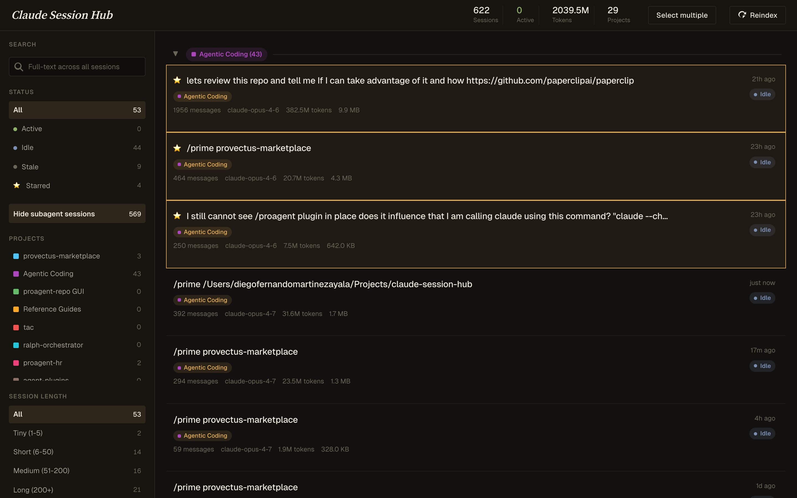
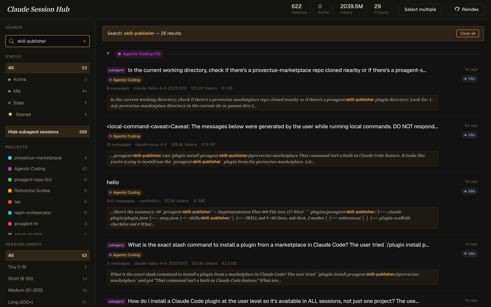
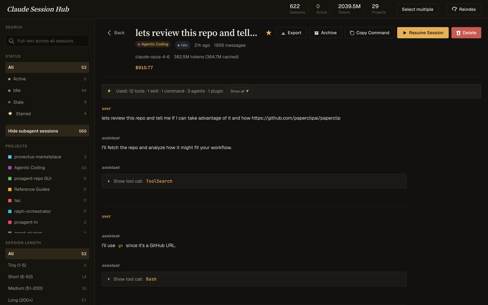
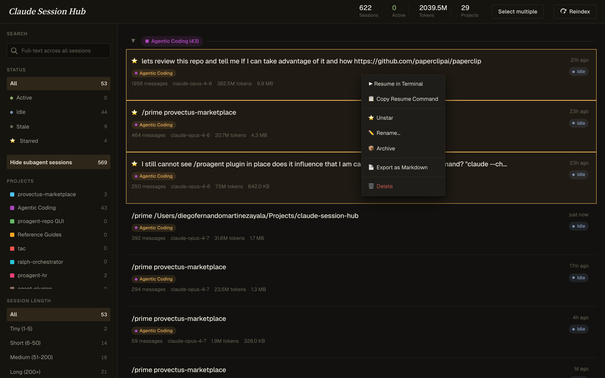
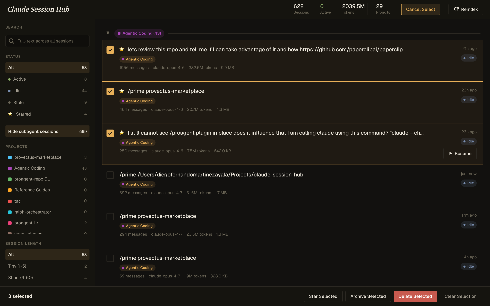
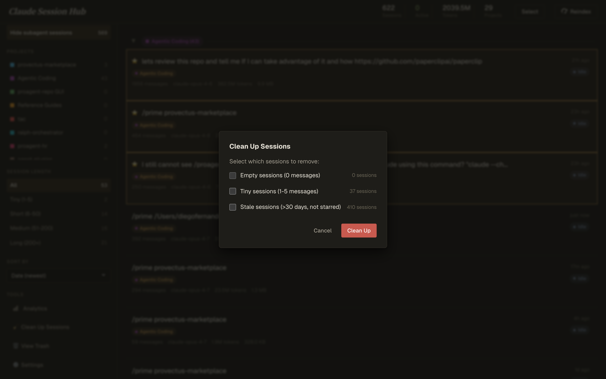
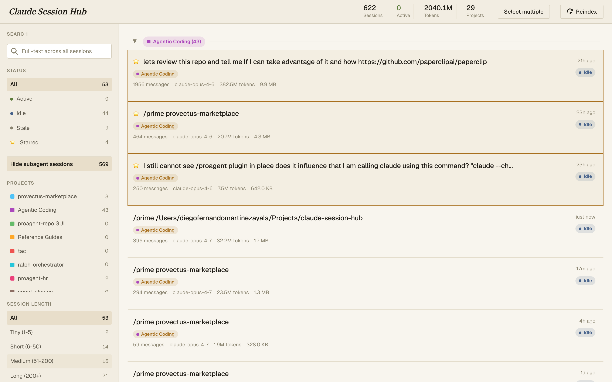
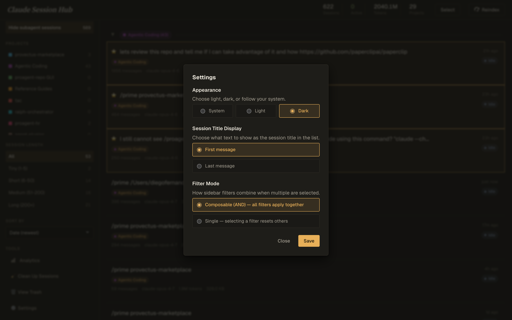

# Claude Session Hub

A local web dashboard for browsing, searching, and managing all your Claude Code sessions. Never lose track of a session again.



## The Problem

Claude Code saves every session to disk, but there's no way to:
- See all your sessions across projects at a glance
- Search for "that session where I fixed the auth bug"
- Know which sessions are currently active
- Resume the right session without guessing UUIDs
- Clean up hundreds of stale sessions

## Features

- **609+ sessions indexed** — reads directly from `~/.claude/projects/`
- **Full-text search** — find any session by content, not just title
- **Active session detection** — see which sessions have running processes (green badge)
- **One-click resume** — opens Terminal.app with the right session loaded
- **Star & label** — pin important sessions, give them memorable names
- **Archive** — protect sessions from Claude Code's 30-day auto-delete
- **Bulk operations** — select multiple sessions for archive/delete/star
- **Session cleanup** — remove empty, tiny, and stale sessions in one click
- **Trash & restore** — deleted sessions go to trash, not oblivion
- **Export** — download any session as Markdown
- **Subagent awareness** — subagent sessions show a badge and resume the parent
- **Light, dark, and system themes** — editorial palette, toggle in settings
- **100% local** — no cloud, no telemetry, no accounts, reads only from your local disk

### Search & Detail View

| Full-text search | Session detail |
|---|---|
|  |  |

### Session Management

| Context menu | Bulk select | Cleanup |
|---|---|---|
|  |  |  |

### Light & Dark Themes

| Light | Settings |
|---|---|
|  |  |

## Quick Start

```bash
git clone https://github.com/diegouis/claude-session-hub.git
cd claude-session-hub
pip install -r requirements.txt
python3 run.py
```

Open http://localhost:7777

## Requirements

- Python 3.10+
- Claude Code installed (sessions at `~/.claude/projects/`)
- macOS (for Terminal.app resume — Linux support is straightforward to add)

## Usage

### Search
Type in the search box or press `Cmd+K`. Searches full conversation text across all sessions. Supports special characters like `skill-publisher`, `plugin.json`, etc.

### Filters
- **Status**: Active (running now), Idle (resumable), Stale (old/empty)
- **Projects**: Filter by project directory
- **Sort**: By date, messages, tokens, or file size

### Session Management
Right-click any session card for the context menu:
- Resume in Terminal / Copy Resume Command
- Star / Unstar
- Rename
- Archive / Delete / Export

### Bulk Operations
Click "Select" in the top bar, check sessions, use the bottom action bar.

### Keyboard Shortcuts
- `Cmd+K` — Focus search
- `Escape` — Go back / close dialogs

## How It Works

The hub reads Claude Code's session files (JSONL format) from `~/.claude/projects/` and `~/.claude/archive/`. It builds a SQLite index with FTS5 full-text search. Active sessions are detected by cross-referencing running `claude` processes with recently-modified session files.

All operations are read-only on your session files. Archive copies files. Delete moves to a local trash. Nothing is sent anywhere.

## Configuration

### Port
```bash
python3 run.py 8080  # custom port
```

### Terminal
The resume feature uses Terminal.app by default via `osascript`. To use a different terminal, modify the `resume_session` function in `server.py`.

## Development

```bash
# Run tests (requires Playwright)
pip install playwright
playwright install chromium
python3 test_gui.py
python3 test_management.py

# Reindex manually
python3 indexer.py full    # full reindex
python3 indexer.py         # incremental
```

## Architecture

```
~/.claude/projects/**/*.jsonl  →  indexer.py  →  SQLite FTS5  →  FastAPI  →  Browser
                                  detector.py ──→ (active session detection)
```

- `indexer.py` — Walks session directories, parses JSONL, builds SQLite index
- `detector.py` — Finds running Claude processes, matches to sessions
- `server.py` — FastAPI app with REST API + SSE for live updates
- `static/app.js` — Vanilla JS frontend (no build step)
- `static/style.css` — Dark theme CSS
- `templates/index.html` — Jinja2 template

## License

MIT
